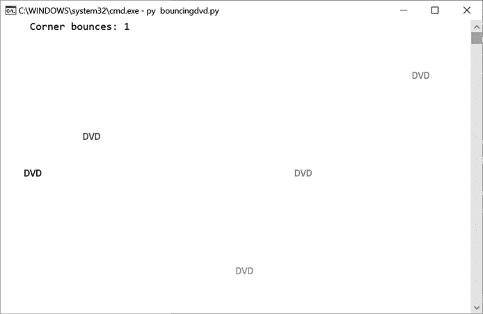

# 五、弹跳 DVD 标志

> 原文：<http://inventwithpython.com/bigbookpython/project5.html>


如果你到了一定的年龄，你会记得那些被称为 DVD 播放器的古老技术设备。当不播放 DVD 时，他们会显示一个从屏幕边缘反弹回来的对角线方向的 DVD 标志。这个程序通过每次碰到边缘时改变方向来模拟这个彩色的 DVD 标志。我们还将记录一个标志点击屏幕一角的次数。这创造了一个有趣的视觉动画，特别是当一个标志与一个角完美地对齐的神奇时刻。

您不能从您的集成开发环境（IDE）或编辑器运行此程序，因为它使用了`bext`模块。因此，必须从命令提示符或终端运行它才能正确显示。你可以在`pypi.org/project/bext`找到更多关于`bext`模块的信息。

## 运行示例

当你运行`bouncingdvd.py`时，输出将看起来像图 5-1 。



`bouncingdvd.py`节目的斜向移动的 DVD 标识

## 工作原理

你可能还记得学校数学课上的笛卡尔坐标。在编程中，x 坐标表示对象的水平位置，y 坐标表示其垂直位置，就像数学中一样。然而，与数学中不同的是，原点`(0, 0)`在屏幕的左上角，y 坐标随着向下移动而增加。x 坐标随着对象向右移动而增加，就像数学中一样。图 5-2 显示了屏幕的坐标系统。


:原点`(0,0)`在屏幕的左上方，x 和 y 坐标分别向右下递增。

`bext`模块的`goto()`功能工作方式相同:调用`bext.goto(0, 0)`将文本光标放在终端窗口的左上角。我们使用一个 Python 字典，用关键字`'color'`、`'direction'`、`'x'`和`'y'`来表示每个跳动的 DVD 标志。`'x'`和`'y'`的值是代表窗口中徽标位置的整数。由于这些值被传递到`bext.goto()`，增加它们将使徽标向右和向下移动，而减少它们将使徽标向左和向上移动。

```py
"""Bouncing DVD Logo, by Al Sweigart email@protected
A bouncing DVD logo animation. You have to be "of a certain age" to
appreciate this. Press Ctrl-C to stop.

NOTE: Do not resize the terminal window while this program is running.
This code is available at https://nostarch.com/big-book-small-python-programming
Tags: short, artistic, bext"""

import sys, random, time

try:
   import bext
except ImportError:
   print('This program requires the bext module, which you')
   print('can install by following the instructions at')
   print('https://pypi.org/project/Bext/')
   sys.exit()

# Set up the constants:
WIDTH, HEIGHT = bext.size()
# We can't print to the last column on Windows without it adding a
# newline automatically, so reduce the width by one:
WIDTH -= 1

NUMBER_OF_LOGOS = 5  # (!) Try changing this to 1 or 100.
PAUSE_AMOUNT = 0.2  # (!) Try changing this to 1.0 or 0.0.
# (!) Try changing this list to fewer colors:
COLORS = ['red', 'green', 'yellow', 'blue', 'magenta', 'cyan', 'white']

UP_RIGHT   = 'ur'
UP_LEFT    = 'ul'
DOWN_RIGHT = 'dr'
DOWN_LEFT  = 'dl'
DIRECTIONS = (UP_RIGHT, UP_LEFT, DOWN_RIGHT, DOWN_LEFT)

# Key names for logo dictionaries:
COLOR = 'color'
X = 'x'
Y = 'y'
DIR = 'direction'


def main():
   bext.clear()

   # Generate some logos.
   logos = []
   for i in range(NUMBER_OF_LOGOS):
       logos.append({COLOR: random.choice(COLORS),
                     X: random.randint(1, WIDTH - 4),
                     Y: random.randint(1, HEIGHT - 4),
                     DIR: random.choice(DIRECTIONS)})
       if logos[-1][X] % 2 == 1:
           # Make sure X is even so it can hit the corner.
           logos[-1][X] -= 1

   cornerBounces = 0  # Count how many times a logo hits a corner.
   while True:  # Main program loop.
       for logo in logos:  # Handle each logo in the logos list.
           # Erase the logo's current location:
           bext.goto(logo[X], logo[Y])
           print('   ', end='')  # (!) Try commenting this line out.

           originalDirection = logo[DIR]

           # See if the logo bounces off the corners:
           if logo[X] == 0 and logo[Y] == 0:
               logo[DIR] = DOWN_RIGHT
               cornerBounces += 1
           elif logo[X] == 0 and logo[Y] == HEIGHT - 1:
               logo[DIR] = UP_RIGHT
               cornerBounces += 1
           elif logo[X] == WIDTH - 3 and logo[Y] == 0:
               logo[DIR] = DOWN_LEFT
               cornerBounces += 1
           elif logo[X] == WIDTH - 3 and logo[Y] == HEIGHT - 1:
               logo[DIR] = UP_LEFT
               cornerBounces += 1

           # See if the logo bounces off the left edge:
           elif logo[X] == 0 and logo[DIR] == UP_LEFT:
               logo[DIR] = UP_RIGHT
           elif logo[X] == 0 and logo[DIR] == DOWN_LEFT:
               logo[DIR] = DOWN_RIGHT

           # See if the logo bounces off the right edge:
           # (WIDTH - 3 because 'DVD' has 3 letters.)
           elif logo[X] == WIDTH - 3 and logo[DIR] == UP_RIGHT:
               logo[DIR] = UP_LEFT
           elif logo[X] == WIDTH - 3 and logo[DIR] == DOWN_RIGHT:
               logo[DIR] = DOWN_LEFT

           # See if the logo bounces off the top edge:
           elif logo[Y] == 0 and logo[DIR] == UP_LEFT:
               logo[DIR] = DOWN_LEFT
           elif logo[Y] == 0 and logo[DIR] == UP_RIGHT:
               logo[DIR] = DOWN_RIGHT

           # See if the logo bounces off the bottom edge:
            elif logo[Y] == HEIGHT - 1 and logo[DIR] == DOWN_LEFT:
                logo[DIR] = UP_LEFT
            elif logo[Y] == HEIGHT - 1 and logo[DIR] == DOWN_RIGHT:
                logo[DIR] = UP_RIGHT

            if logo[DIR] != originalDirection:
                # Change color when the logo bounces:
                logo[COLOR] = random.choice(COLORS)

            # Move the logo. (X moves by 2 because the terminal
            # characters are twice as tall as they are wide.)
            if logo[DIR] == UP_RIGHT:
                logo[X] += 2
                logo[Y] -= 1
            elif logo[DIR] == UP_LEFT:
                logo[X] -= 2
                logo[Y] -= 1
            elif logo[DIR] == DOWN_RIGHT:
                logo[X] += 2
                logo[Y] += 1
            elif logo[DIR] == DOWN_LEFT:
                logo[X] -= 2
                logo[Y] += 1

        # Display number of corner bounces:
        bext.goto(5, 0)
        bext.fg('white')
        print('Corner bounces:', cornerBounces, end='')

        for logo in logos:
            # Draw the logos at their new location:
            bext.goto(logo[X], logo[Y])
            bext.fg(logo[COLOR])
            print('DVD', end='')

        bext.goto(0, 0)

        sys.stdout.flush()  # (Required for bext-using programs.)
        time.sleep(PAUSE_AMOUNT)


# If this program was run (instead of imported), run the game:
if __name__ == '__main__':
    try:
        main()
    except KeyboardInterrupt:
        print()
        print('Bouncing DVD Logo, by Al Sweigart')
        sys.exit()  # When Ctrl-C is pressed, end the program. 
```

在输入源代码并运行几次之后，尝试对其进行实验性的修改。标有`(!)`的评论对你可以做的小改变有建议。你也可以自己想办法做到以下几点:

*   更改`NUMBER_OF_LOGOS`以增加屏幕上跳跃标志的数量。
*   更改`PAUSE_AMOUNT`以加快或减慢徽标的速度。

## 探索程序

试着找出下列问题的答案。尝试对代码进行一些修改，然后重新运行程序，看看这些修改有什么影响。

1.  如果把第 20 行的`WIDTH, HEIGHT = bext.size()`改成`WIDTH, HEIGHT = 10, 5`会怎么样？
2.  如果把第 52 行的`DIR: random.choice(DIRECTIONS)`换成`DIR: DOWN_RIGHT`会怎么样？
3.  如何让`'Corner bounces:'`文字不出现在屏幕上？
4.  如果删除或注释掉第 57 行的`cornerBounces = 0`,会得到什么错误信息？