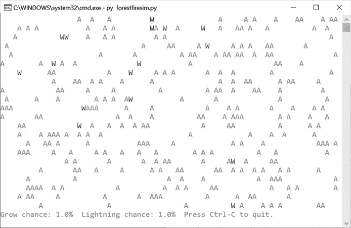

# #29 森林火灾模拟

> 原文：<http://inventwithpython.com/bigbookpython/project29.html>


这个模拟展示了一个森林，它的树木不断生长，然后被烧毁。在模拟的每一步中，有 1%的可能性一片空白长成一棵树，有 1%的可能性一棵树被闪电击中并烧毁。大火会蔓延到邻近的树木，所以密集的森林比稀疏的森林更容易遭受更大的火灾。这个模拟的灵感来自尼基·凯斯在`ncase.me/simulating/model`的表情符号。

## 行动中的计划

当您运行 *forestfiresim.py* 时，输出将如下所示:



:森林火灾模拟，绿色 *A* s 表示树木，红色 *W* s 表示火焰

## 它是如何工作的

这个模拟是*涌现行为*的一个例子——系统中简单部分之间的相互作用创造了复杂的模式。空地长成树，闪电把树变成火，火又把树变回空地，同时蔓延到邻近的树。通过调整树木生长和雷击率，您可以使森林显示不同的现象。例如，闪电几率低但生长率高会导致持续的大面积森林火灾，因为树木往往彼此靠近并迅速补充。增长率低，但雷击几率高，会引发几起小火灾，但由于附近缺乏树木，这些小火灾很快就会熄灭。我们不会显式地对这些行为进行编程；相反，它自然地从我们创造的系统中出现。

```py
 1\. """Forest Fire Sim, by Al Sweigart email@protected
 2\. A simulation of wildfires spreading in a forest. Press Ctrl-C to stop.
 3\. Inspired by Nicky Case's Emoji Sim http://ncase.me/simulating/model/
 4\. This code is available at https://nostarch.com/big-book-small-python-programming
 5\. Tags: short, bext, simulation"""
 6\. 
 7\. import random, sys, time
 8\. 
 9\. try:
 10\.    import bext
 11\. except ImportError:
 12\.    print('This program requires the bext module, which you')
 13\.    print('can install by following the instructions at')
 14\.    print('https://pypi.org/project/Bext/')
 15\.    sys.exit()
 16\. 
 17\. # Set up the constants:
 18\. WIDTH = 79
 19\. HEIGHT = 22
 20\. 
 21\. TREE = 'A'
 22\. FIRE = 'W'
 23\. EMPTY = ' '
 24\. 
 25\. # (!) Try changing these settings to anything between 0.0 and 1.0:
 26\. INITIAL_TREE_DENSITY = 0.20  # Amount of forest that starts with trees.
 27\. GROW_CHANCE = 0.01  # Chance a blank space turns into a tree.
 28\. FIRE_CHANCE = 0.01  # Chance a tree is hit by lightning & burns.
 29\. 
 30\. # (!) Try setting the pause length to 1.0 or 0.0:
 31\. PAUSE_LENGTH = 0.5
 32\. 
 33\. 
 34\. def main():
 35\.    forest = createNewForest()
 36\.    bext.clear()
 37\. 
 38\.    while True:  # Main program loop.
 39\.        displayForest(forest)
 40\. 
 41\.        # Run a single simulation step:
 42\.        nextForest = {'width': forest['width'],
 43\.                      'height': forest['height']}
 44\. 
 45\.        for x in range(forest['width']):
 46\.            for y in range(forest['height']):
 47\.                if (x, y) in nextForest:
 48\.                    # If we've already set nextForest[(x, y)] on a
 49\.                    # previous iteration, just do nothing here:
 50\.                    continue
 51\. 
 52\.                if ((forest[(x, y)] == EMPTY)
 53\.                    and (random.random() <= GROW_CHANCE)):
 54\.                    # Grow a tree in this empty space.
 55\.                    nextForest[(x, y)] = TREE
 56\.                elif ((forest[(x, y)] == TREE)
 57\.                    and (random.random() <= FIRE_CHANCE)):
 58\.                    # Lightning sets this tree on fire.
 59\.                    nextForest[(x, y)] = FIRE
 60\.                elif forest[(x, y)] == FIRE:
 61\.                    # This tree is currently burning.
 62\.                    # Loop through all the neighboring spaces:
 63\.                    for ix in range(-1, 2):
 64\.                        for iy in range(-1, 2):
 65\.                            # Fire spreads to neighboring trees:
 66\.                            if forest.get((x + ix, y + iy)) == TREE:
 67\.                                nextForest[(x + ix, y + iy)] = FIRE
 68\.                    # The tree has burned down now, so erase it:
 69\.                    nextForest[(x, y)] = EMPTY
 70\.                else:
 71\.                    # Just copy the existing object:
 72\.                    nextForest[(x, y)] = forest[(x, y)]
 73\.        forest = nextForest
 74\. 
 75\.        time.sleep(PAUSE_LENGTH)
 76\. 
 77\. 
 78\. def createNewForest():
 79\.    """Returns a dictionary for a new forest data structure."""
 80\.    forest = {'width': WIDTH, 'height': HEIGHT}
 81\.    for x in range(WIDTH):
 82\.        for y in range(HEIGHT):
 83\.            if (random.random() * 100) <= INITIAL_TREE_DENSITY:
 84\.                forest[(x, y)] = TREE  # Start as a tree.
 85\.            else:
 86\.                forest[(x, y)] = EMPTY  # Start as an empty space.
 87\.    return forest
 88\. 
 89\. 
 90\. def displayForest(forest):
 91\.    """Display the forest data structure on the screen."""
 92\.    bext.goto(0, 0)
 93\.    for y in range(forest['height']):
 94\.        for x in range(forest['width']):
 95\.            if forest[(x, y)] == TREE:
 96\.                bext.fg('green')
 97\.                print(TREE, end='')
 98\.            elif forest[(x, y)] == FIRE:
 99\.                bext.fg('red')
100\.                 print(FIRE, end='')
101\.             elif forest[(x, y)] == EMPTY:
102\.                 print(EMPTY, end='')
103\.         print()
104\.     bext.fg('reset')  # Use the default font color.
105\.     print('Grow chance: {}%  '.format(GROW_CHANCE * 100), end='')
106\.     print('Lightning chance: {}%  '.format(FIRE_CHANCE * 100), end='')
107\.     print('Press Ctrl-C to quit.')
108\. 
109\. 
110\. # If this program was run (instead of imported), run the game:
111\. if __name__ == '__main__':
112\.     try:
113\.         main()
114\.     except KeyboardInterrupt:
115\.         sys.exit()  # When Ctrl-C is pressed, end the program. 
```

在输入源代码并运行几次之后，尝试对其进行实验性的修改。标有`(!)`的评论对你可以做的小改变有建议。你也可以自己想办法做到以下几点:

*   添加随机创建的湖泊和河流，作为火焰无法穿越的防火屏障。
*   加上一棵树从它的邻居那里着火的百分比几率。
*   添加不同种类的树，着火几率不同。
*   添加燃烧树木的不同状态，以便一棵树被烧毁需要多个模拟步骤。

## 探索计划

试着找出下列问题的答案。尝试对代码进行一些修改，然后重新运行程序，看看这些修改有什么影响。

1.  如果把第 96 行的`bext.fg('green')`改成`bext.fg('random')`会怎么样？
2.  如果把第 23 行的`EMPTY = ' '`改成`EMPTY = '.'`会怎么样？
3.  如果把第 66 行的`forest.get((x + ix, y + iy)) == TREE`改成`forest.get((x + ix, y + iy)) == EMPTY`会怎么样？
4.  如果把第 69 行的`nextForest[(x, y)] = EMPTY`改成`nextForest[(x, y)] = FIRE`会怎么样？
5.  如果把 86 行的`forest[(x, y)] = EMPTY`改成`forest[(x, y)] = TREE`会怎么样？