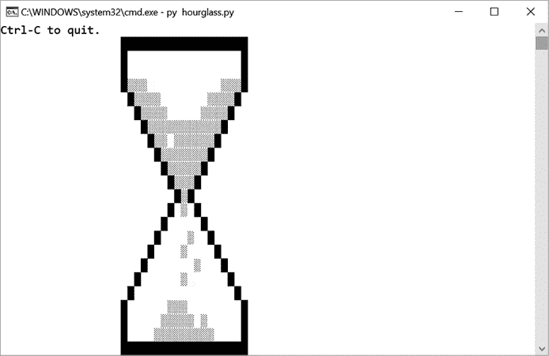

# #36 沙漏

> 原文：<http://inventwithpython.com/bigbookpython/project36.html>

这个可视化程序有一个粗糙的物理引擎，模拟沙子通过沙漏的小孔落下。沙子堆积在沙漏的下半部分；然后把沙漏翻过来，重复这个过程。

## 行动中的计划

图 36-1 显示了运行*沙漏. py* 时的输出。



:沙漏程序在落砂时的输出

## 它是如何工作的

沙漏程序实现了一个基本的物理引擎。一个*物理引擎*是模拟物理物体在重力作用下下落，相互碰撞，按照物理定律运动的软件。你会发现在视频游戏、计算机动画和科学模拟中使用的物理引擎。在第 91 到 102 行，每一粒沙子检查它下面的空间是否是空的，如果是，就向下移动。否则，它检查它是否可以向左下方移动(第 104 到 112 行)或向右下方移动(第 114 到 122 行)。当然，*运动学*，经典物理学的一个分支，处理宏观物体的运动，远不止这些。然而，你不需要一个物理学学位来制作一个沙漏中沙子的原始模拟，它看起来是令人愉快的。

```py
 1\. """Hourglass, by Al Sweigart [[email protected]](/cdn-cgi/l/email-protection)
 2\. An animation of an hourglass with falling sand. Press Ctrl-C to stop.
 3\. This code is available at https://nostarch.com/big-book-small-python-programming
 4\. Tags: large, artistic, bext, simulation"""
 5\. 
 6\. import random, sys, time
 7\. 
 8\. try:
 9\.    import bext
 10\. except ImportError:
 11\.    print('This program requires the bext module, which you')
 12\.    print('can install by following the instructions at')
 13\.    print('https://pypi.org/project/Bext/')
 14\.    sys.exit()
 15\. 
 16\. # Set up the constants:
 17\. PAUSE_LENGTH = 0.2  # (!) Try changing this to 0.0 or 1.0.
 18\. # (!) Try changing this to any number between 0 and 100:
 19\. WIDE_FALL_CHANCE = 50
 20\. 
 21\. SCREEN_WIDTH = 79
 22\. SCREEN_HEIGHT = 25
 23\. X = 0  # The index of X values in an (x, y) tuple is 0.
 24\. Y = 1  # The index of Y values in an (x, y) tuple is 1.
 25\. SAND = chr(9617)
 26\. WALL = chr(9608)
 27\. 
 28\. # Set up the walls of the hour glass:
 29\. HOURGLASS = set()  # Has (x, y) tuples for where hourglass walls are.
 30\. # (!) Try commenting out some HOURGLASS.add() lines to erase walls:
 31\. for i in range(18, 37):
 32\.    HOURGLASS.add((i, 1))  # Add walls for the top cap of the hourglass.
 33\.    HOURGLASS.add((i, 23))  # Add walls for the bottom cap.
 34\. for i in range(1, 5):
 35\.    HOURGLASS.add((18, i))  # Add walls for the top left straight wall.
 36\.    HOURGLASS.add((36, i))  # Add walls for the top right straight wall.
 37\.    HOURGLASS.add((18, i + 19))  # Add walls for the bottom left.
 38\.    HOURGLASS.add((36, i + 19))  # Add walls for the bottom right.
 39\. for i in range(8):
 40\.    HOURGLASS.add((19 + i, 5 + i))  # Add the top left slanted wall.
 41\.    HOURGLASS.add((35 - i, 5 + i))  # Add the top right slanted wall.
 42\.    HOURGLASS.add((25 - i, 13 + i))  # Add the bottom left slanted wall.
 43\.    HOURGLASS.add((29 + i, 13 + i))  # Add the bottom right slanted wall.
 44\. 
 45\. # Set up the initial sand at the top of the hourglass:
 46\. INITIAL_SAND = set()
 47\. for y in range(8):
 48\.    for x in range(19 + y, 36 - y):
 49\.        INITIAL_SAND.add((x, y + 4))
 50\. 
 51\. 
 52\. def main():
 53\.    bext.fg('yellow')
 54\.    bext.clear()
 55\. 
 56\.    # Draw the quit message:
 57\.    bext.goto(0, 0)
 58\.    print('Ctrl-C to quit.', end='')
 59\. 
 60\.    # Display the walls of the hourglass:
 61\.    for wall in HOURGLASS:
 62\.        bext.goto(wall[X], wall[Y])
 63\.        print(WALL, end='')
 64\. 
 65\.    while True:  # Main program loop.
 66\.        allSand = list(INITIAL_SAND)
 67\. 
 68\.        # Draw the initial sand:
 69\.        for sand in allSand:
 70\.            bext.goto(sand[X], sand[Y])
 71\.            print(SAND, end='')
 72\. 
 73\.        runHourglassSimulation(allSand)
 74\. 
 75\. 
 76\. def runHourglassSimulation(allSand):
 77\.    """Keep running the sand falling simulation until the sand stops
 78\.    moving."""
 79\.    while True:  # Keep looping until sand has run out.
 80\.        random.shuffle(allSand)  # Random order of grain simulation.
 81\. 
 82\.        sandMovedOnThisStep = False
 83\.        for i, sand in enumerate(allSand):
 84\.            if sand[Y] == SCREEN_HEIGHT - 1:
 85\.                # Sand is on the very bottom, so it won't move:
 86\.                continue
 87\. 
 88\.            # If nothing is under this sand, move it down:
 89\.            noSandBelow = (sand[X], sand[Y] + 1) not in allSand
 90\.            noWallBelow = (sand[X], sand[Y] + 1) not in HOURGLASS
 91\.            canFallDown = noSandBelow and noWallBelow
 92\. 
 93\.            if canFallDown:
 94\.                # Draw the sand in its new position down one space:
 95\.                bext.goto(sand[X], sand[Y])
 96\.                print(' ', end='')  # Clear the old position.
 97\.                bext.goto(sand[X], sand[Y] + 1)
 98\.                print(SAND, end='')
 99\. 
100\.                 # Set the sand in its new position down one space:
101\.                 allSand[i] = (sand[X], sand[Y] + 1)
102\.                 sandMovedOnThisStep = True
103\.             else:
104\.                 # Check if the sand can fall to the left:
105\.                 belowLeft = (sand[X] - 1, sand[Y] + 1)
106\.                 noSandBelowLeft = belowLeft not in allSand
107\.                 noWallBelowLeft = belowLeft not in HOURGLASS
108\.                 left = (sand[X] - 1, sand[Y])
109\.                 noWallLeft = left not in HOURGLASS
110\.                 notOnLeftEdge = sand[X] > 0
111\.                 canFallLeft = (noSandBelowLeft and noWallBelowLeft
112\.                     and noWallLeft and notOnLeftEdge)
113\. 
114\.                 # Check if the sand can fall to the right:
115\.                 belowRight = (sand[X] + 1, sand[Y] + 1)
116\.                 noSandBelowRight = belowRight not in allSand
117\.                 noWallBelowRight = belowRight not in HOURGLASS
118\.                 right = (sand[X] + 1, sand[Y])
119\.                 noWallRight = right not in HOURGLASS
120\.                 notOnRightEdge = sand[X] < SCREEN_WIDTH - 1
121\.                 canFallRight = (noSandBelowRight and noWallBelowRight
122\.                     and noWallRight and notOnRightEdge)
123\. 
124\.                 # Set the falling direction:
125\.                 fallingDirection = None
126\.                 if canFallLeft and not canFallRight:
127\.                     fallingDirection = -1  # Set the sand to fall left.
128\.                 elif not canFallLeft and canFallRight:
129\.                     fallingDirection = 1  # Set the sand to fall right.
130\.                 elif canFallLeft and canFallRight:
131\.                     # Both are possible, so randomly set it:
132\.                     fallingDirection = random.choice((-1, 1))
133\. 
134\.                 # Check if the sand can "far" fall two spaces to
135\.                 # the left or right instead of just one space:
136\.                 if random.random() * 100 <= WIDE_FALL_CHANCE:
137\.                     belowTwoLeft = (sand[X] - 2, sand[Y] + 1)
138\.                     noSandBelowTwoLeft = belowTwoLeft not in allSand
139\.                     noWallBelowTwoLeft = belowTwoLeft not in HOURGLASS
140\.                     notOnSecondToLeftEdge = sand[X] > 1
141\.                     canFallTwoLeft = (canFallLeft and noSandBelowTwoLeft
142\.                         and noWallBelowTwoLeft and notOnSecondToLeftEdge)
143\. 
144\.                     belowTwoRight = (sand[X] + 2, sand[Y] + 1)
145\.                     noSandBelowTwoRight = belowTwoRight not in allSand
146\.                     noWallBelowTwoRight = belowTwoRight not in HOURGLASS
147\.                     notOnSecondToRightEdge = sand[X] < SCREEN_WIDTH - 2
148\.                     canFallTwoRight = (canFallRight
149\.                         and noSandBelowTwoRight and noWallBelowTwoRight
150\.                         and notOnSecondToRightEdge)
151\. 
152\.                     if canFallTwoLeft and not canFallTwoRight:
153\.                         fallingDirection = -2
154\.                     elif not canFallTwoLeft and canFallTwoRight:
155\.                         fallingDirection = 2
156\.                     elif canFallTwoLeft and canFallTwoRight:
157\.                         fallingDirection = random.choice((-2, 2))
158\. 
159\.                 if fallingDirection == None:
160\.                     # This sand can't fall, so move on.
161\.                     continue
162\. 
163\.                 # Draw the sand in its new position:
164\.                 bext.goto(sand[X], sand[Y])
165\.                 print(' ', end='')  # Erase old sand.
166\.                 bext.goto(sand[X] + fallingDirection, sand[Y] + 1)
167\.                 print(SAND, end='')  # Draw new sand.
168\. 
169\.                 # Move the grain of sand to its new position:
170\.                 allSand[i] = (sand[X] + fallingDirection, sand[Y] + 1)
171\.                 sandMovedOnThisStep = True
172\. 
173\.         sys.stdout.flush()  # (Required for bext-using programs.)
174\.         time.sleep(PAUSE_LENGTH)  # Pause after this
175\. 
176\.         # If no sand has moved on this step, reset the hourglass:
177\.         if not sandMovedOnThisStep:
178\.             time.sleep(2)
179\.             # Erase all of the sand:
180\.             for sand in allSand:
181\.                 bext.goto(sand[X], sand[Y])
182\.                 print(' ', end='')
183\.             break  # Break out of main simulation loop.
184\. 
185\. 
186\. # If this program was run (instead of imported), run the game:
187\. if __name__ == '__main__':
188\.     try:
189\.         main()
190\.     except KeyboardInterrupt:
191\.         sys.exit()  # When Ctrl-C is pressed, end the program. 
```

在输入源代码并运行几次之后，尝试对其进行实验性的修改。标有`(!)`的评论对你可以做的小改变有建议。你也可以自己想办法做到以下几点:

*   创建除沙漏以外的墙壁形状。
*   在屏幕上创建点，不断涌出新的沙粒。

## 探索计划

试着找出下列问题的答案。尝试对代码进行一些修改，然后重新运行程序，看看这些修改有什么影响。

1.  如果把第 31 行的`range(18, 37)`改成`range(18, 30)`会怎么样？
2.  如果把第 39 行的`range(8)`改成`range(0)`会怎么样？
3.  如果把第 82 行的`sandMovedOnThisStep = False`改成`sandMovedOnThisStep = True`会怎么样？
4.  如果把 125 行的`fallingDirection = None`改成`fallingDirection = 1`会怎么样？
5.  如果把 136 行的`random.random() * 100 <= WIDE_FALL_CHANCE`改成`random.random() * 0 <= WIDE_FALL_CHANCE`会怎么样？