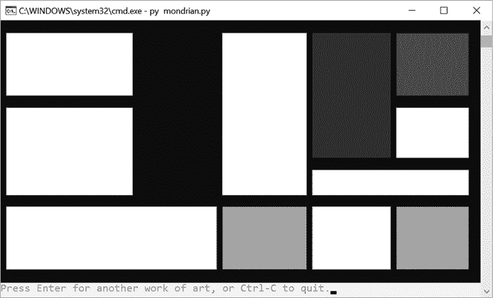

# 四十七、蒙德里安艺术生成器

> 原文：<http://inventwithpython.com/bigbookpython/project47.html>


皮耶·蒙德里安是 20 世纪的荷兰画家，也是抽象艺术运动“新塑料主义”的创始人之一。他最具标志性的画作依赖于原色（蓝、黄、红）、黑色和白色。他采用极简主义的方法，用水平和垂直的元素将这些颜色分开。

这个程序随机生成遵循蒙德里安风格的绘画。你可以在`en.wikipedia.org/wiki/Piet_Mondrian`找到更多关于皮特·蒙德里安的信息。

## 运行示例

`bext`模块允许我们的 Python 程序在文本输出中显示明亮的原色，尽管这本书只显示黑白图像。图 47-1 显示了运行`mondrian.py`时的输出。



图 47-1 :蒙德里安艺术程序的计算机生成艺术。程序每次运行都会生成不同的图像。

## 工作原理

该算法通过创建一个带有随机间隔的垂直线和水平线的数据结构（`canvas`字典）来工作，如图图 47-2 。


:蒙德里安艺术算法的第一步是创建一个网格。

接下来，它移除一些线段来创建更大的矩形，如图图 47-3 所示。


:蒙德里安艺术算法的第二步随机去掉一些线条。

最后，算法用黄色、红色、蓝色或黑色随机填充一些矩形，如图图 47-4 。


:蒙德里安艺术算法第三步随机选择矩形填充颜色。

你可以在`github.com/asweigart/mondrian_art_generator`找到这个蒙德里安艺术生成器的另一个版本，还有一些样本图片。

```py
"""Mondrian Art Generator, by Al Sweigart email@protected
Randomly generates art in the style of Piet Mondrian.
More info at: https://en.wikipedia.org/wiki/Piet_Mondrian
This code is available at https://nostarch.com/big-book-small-python-programming
Tags: large, artistic, bext"""

import sys, random

try:
   import bext
except ImportError:
   print('This program requires the bext module, which you')
   print('can install by following the instructions at')
   print('https://pypi.org/project/Bext/')
   sys.exit()

# Set up the constants:
MIN_X_INCREASE = 6
MAX_X_INCREASE = 16
MIN_Y_INCREASE = 3
MAX_Y_INCREASE = 6
WHITE = 'white'
BLACK = 'black'
RED = 'red'
YELLOW = 'yellow'
BLUE = 'blue'

# Setup the screen:
width, height = bext.size()
# We can't print to the last column on Windows without it adding a
# newline automatically, so reduce the width by one:
width -= 1

height -= 3

while True:  # Main application loop.
   # Pre-populate the canvas with blank spaces:
   canvas = {}
   for x in range(width):
       for y in range(height):
           canvas[(x, y)] = WHITE

   # Generate vertical lines:
   numberOfSegmentsToDelete = 0
   x = random.randint(MIN_X_INCREASE, MAX_X_INCREASE)
   while x < width - MIN_X_INCREASE:
       numberOfSegmentsToDelete += 1
       for y in range(height):
           canvas[(x, y)] = BLACK
       x += random.randint(MIN_X_INCREASE, MAX_X_INCREASE)

   # Generate horizontal lines:
   y = random.randint(MIN_Y_INCREASE, MAX_Y_INCREASE)
   while y < height - MIN_Y_INCREASE:
       numberOfSegmentsToDelete += 1
       for x in range(width):
           canvas[(x, y)] = BLACK
       y += random.randint(MIN_Y_INCREASE, MAX_Y_INCREASE)

   numberOfRectanglesToPaint = numberOfSegmentsToDelete - 3
   numberOfSegmentsToDelete = int(numberOfSegmentsToDelete * 1.5)

   # Randomly select points and try to remove them.
   for i in range(numberOfSegmentsToDelete):
       while True:  # Keep selecting segments to try to delete.
           # Get a random start point on an existing segment:
           startx = random.randint(1, width - 2)
           starty = random.randint(1, height - 2)
           if canvas[(startx, starty)] == WHITE:
               continue

           # Find out if we're on a vertical or horizontal segment:
           if (canvas[(startx - 1, starty)] == WHITE and
               canvas[(startx + 1, starty)] == WHITE):
               orientation = 'vertical'
           elif (canvas[(startx, starty - 1)] == WHITE and
               canvas[(startx, starty + 1)] == WHITE):
               orientation = 'horizontal'
           else:
               # The start point is on an intersection,
               # so get a new random start point:
               continue

           pointsToDelete = [(startx, starty)]

           canDeleteSegment = True
           if orientation == 'vertical':
               # Go up one path from the start point, and
               # see if we can remove this segment:
               for changey in (-1, 1):
                   y = starty
                   while 0 < y < height - 1:
                       y += changey
                       if (canvas[(startx - 1, y)] == BLACK and
                           canvas[(startx + 1, y)] == BLACK):
                           # We've found a four-way intersection.
                           break
                       elif ((canvas[(startx - 1, y)] == WHITE and
                              canvas[(startx + 1, y)] == BLACK) or
                              (canvas[(startx - 1, y)] == BLACK and
                               canvas[(startx + 1, y)] == WHITE)):
                            # We've found a T-intersection; we can't
                            # delete this segment:
                            canDeleteSegment = False
                            break
                        else:
                            pointsToDelete.append((startx, y))

            elif orientation == 'horizontal':
                # Go up one path from the start point, and
                # see if we can remove this segment:
                for changex in (-1, 1):
                    x = startx
                    while 0 < x < width - 1:
                        x += changex
                        if (canvas[(x, starty - 1)] == BLACK and
                            canvas[(x, starty + 1)] == BLACK):
                            # We've found a four-way intersection.
                            break
                        elif ((canvas[(x, starty - 1)] == WHITE and
                               canvas[(x, starty + 1)] == BLACK) or
                              (canvas[(x, starty - 1)] == BLACK and
                               canvas[(x, starty + 1)] == WHITE)):
                            # We've found a T-intersection; we can't
                            # delete this segment:
                            canDeleteSegment = False
                            break
                        else:
                            pointsToDelete.append((x, starty))
            if not canDeleteSegment:
                continue  # Get a new random start point.
            break  # Move on to delete the segment.

        # If we can delete this segment, set all the points to white:
        for x, y in pointsToDelete:
            canvas[(x, y)] = WHITE

    # Add the border lines:
    for x in range(width):
        canvas[(x, 0)] = BLACK  # Top border.
        canvas[(x, height - 1)] = BLACK  # Bottom border.
    for y in range(height):
        canvas[(0, y)] = BLACK  # Left border.
        canvas[(width - 1, y)] = BLACK  # Right border.

    # Paint the rectangles:
    for i in range(numberOfRectanglesToPaint):
        while True:
            startx = random.randint(1, width - 2)
            starty = random.randint(1, height - 2)

            if canvas[(startx, starty)] != WHITE:
                continue  # Get a new random start point.
            else:
                break

        # Flood fill algorithm:
        colorToPaint = random.choice([RED, YELLOW, BLUE, BLACK])
        pointsToPaint = set([(startx, starty)])
        while len(pointsToPaint) > 0:
            x, y = pointsToPaint.pop()
            canvas[(x, y)] = colorToPaint
            if canvas[(x - 1, y)] == WHITE:
                pointsToPaint.add((x - 1, y))
            if canvas[(x + 1, y)] == WHITE:
                pointsToPaint.add((x + 1, y))
            if canvas[(x, y - 1)] == WHITE:
                pointsToPaint.add((x, y - 1))
            if canvas[(x, y + 1)] == WHITE:
                pointsToPaint.add((x, y + 1))

    # Draw the canvas data structure:
    for y in range(height):
        for x in range(width):
            bext.bg(canvas[(x, y)])
            print(' ', end='')

        print()

    # Prompt user to create a new one:
    try:
        input('Press Enter for another work of art, or Ctrl-C to quit.')
    except KeyboardInterrupt:
        sys.exit() 
```

在输入源代码并运行几次之后，尝试对其进行实验性的修改。你也可以自己想办法做到以下几点:

*   用不同的调色板创建程序。
*   使用`Pillow`模块制作蒙德里安艺术的图像文件。你可以从《Python 自动化指南》第 19 章了解这个模块，[`automatetheboringstuff.com/2e/chapter19`](https://automatetheboringstuff.com/2e/chapter19/)。

## 探索程序

试着找出下列问题的答案。尝试对代码进行一些修改，然后重新运行程序，看看这些修改有什么影响。

1.  如果把第 41 行的`canvas[(x, y)] = WHITE`改成`canvas[(x, y)] = RED`会出现什么错误？
2.  如果把 176 行的`print(' ', end='')`改成`print('A', end='')`会怎么样？