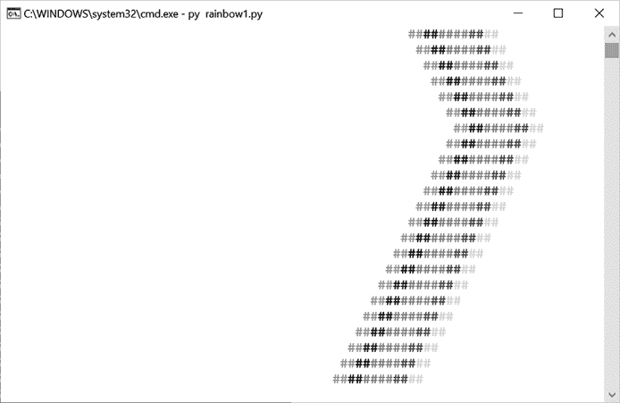

# 五十八、彩虹

> 原文：<http://inventwithpython.com/bigbookpython/project58.html>


彩虹是一个简单的程序，显示了一个彩色的彩虹在屏幕上来回移动。该程序利用了这样一个事实，即当新的文本行出现时，现有的文本会向上滚动，使其看起来像是在移动。这个项目对初学者来说很好，它类似于项目 15“深坑”

## 运行示例

图 58-1 显示了运行`rainbow.py`时的输出。



:彩虹的锯齿形输出，在屏幕上是彩色的

## 工作原理

这个程序连续打印相同的彩虹图案。改变的是打印在它左边的空格字符的数量。增加这个数字会使彩虹向右移动，减少这个数字会使彩虹向左移动。`indent`变量跟踪空格的数量。将`indentIncreasing`变量设置为`True`表示`indent`应该增加，直到到达`60`，此时变为`False`。代码的其余部分减少了空格的数量。一旦到达`0`，它又变回`True`，重复彩虹的之字形。

```py
"""Rainbow, by Al Sweigart email@protected
Shows a simple rainbow animation. Press Ctrl-C to stop.
This code is available at https://nostarch.com/big-book-small-python-programming
Tags: tiny, artistic, bext, beginner, scrolling"""

import time, sys

try:
   import bext
except ImportError:
    print('This program requires the bext module, which you')
    print('can install by following the instructions at')
    print('https://pypi.org/project/Bext/')
    sys.exit()

print('Rainbow, by Al Sweigart email@protected')
print('Press Ctrl-C to stop.')
time.sleep(3)

indent = 0  # How many spaces to indent.
indentIncreasing = True  # Whether the indentation is increasing or not.

try:
    while True:  # Main program loop.
        print(' ' * indent, end='')
        bext.fg('red')
        print('##', end='')
        bext.fg('yellow')
        print('##', end='')
        bext.fg('green')
        print('##', end='')
        bext.fg('blue')
        print('##', end='')
        bext.fg('cyan')
        print('##', end='')
        bext.fg('purple')
        print('##')

        if indentIncreasing:
            # Increase the number of spaces:
            indent = indent + 1
            if indent == 60:  # (!) Change this to 10 or 30.
                # Change direction:
                indentIncreasing = False
        else:
            # Decrease the number of spaces:
            indent = indent - 1
            if indent == 0:
                # Change direction:
                indentIncreasing = True

        time.sleep(0.02)  # Add a slight pause.
except KeyboardInterrupt:
    sys.exit()  # When Ctrl-C is pressed, end the program. 
```

## 探索程序

试着找出下列问题的答案。尝试对代码进行一些修改，然后重新运行程序，看看这些修改有什么影响。

1.  如果把第 44 行的`False`改成`True`会怎么样？
2.  如果将所有`bext.fg()`调用的参数都改为`'random'`，会发生什么？