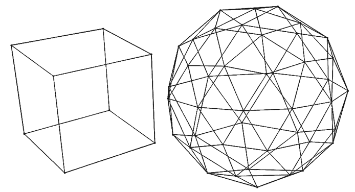
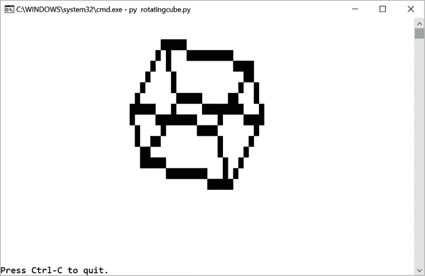

# #62 旋转立方体

> 原文：<http://inventwithpython.com/bigbookpython/project62.html>

这个项目的特点是使用三角函数的 3D 立方体旋转动画。您可以在自己的动画程序中修改 3D 点旋转数学和`line()`功能。

虽然我们将用来绘制立方体的块文本字符看起来不像细而直的线，但这种绘制被称为*线框模型*，因为它只渲染物体表面的边缘。[图 62-1](#calibre_link-347) 显示了立方体和 icosphere 的线框模型，icosphere 是一个由三角形组成的粗糙球体。



:立方体(左)和 icosphere(右)的线框模型

## 行动中的计划

图 62-2 显示了运行 *rotatingcube.py* 时的输出。



:程序绘制到屏幕上的线框立方体

## 它是如何工作的

这个算法有两个主要部分:函数`line()`和函数`rotatePoint()`。立方体有八个点，每个角一个。程序将这些角存储为`CUBE_CORNERS`列表中的`(` `x` `,` `y` `,` `z` `)`元组。这些点也定义了立方体边缘线的连接。当所有的点都向同一个方向旋转相同的量时，它们会产生立方体旋转的错觉。

```py
 1\. """Rotating Cube, by Al Sweigart [[email protected]](/cdn-cgi/l/email-protection)
 2\. A rotating cube animation. Press Ctrl-C to stop.
 3\. This code is available at https://nostarch.com/big-book-small-python-programming
 4\. Tags: large, artistic, math"""
 5\. 
 6\. # This program MUST be run in a Terminal/Command Prompt window.
 7\. 
 8\. import math, time, sys, os
 9\. 
 10\. # Set up the constants:
 11\. PAUSE_AMOUNT = 0.1  # Pause length of one-tenth of a second.
 12\. WIDTH, HEIGHT = 80, 24
 13\. SCALEX = (WIDTH - 4) // 8
 14\. SCALEY = (HEIGHT - 4) // 8
 15\. # Text cells are twice as tall as they are wide, so set scaley:
 16\. SCALEY *= 2
 17\. TRANSLATEX = (WIDTH - 4) // 2
 18\. TRANSLATEY = (HEIGHT - 4) // 2
 19\. 
 20\. # (!) Try changing this to '#' or '*' or some other character:
 21\. LINE_CHAR = chr(9608)  # Character 9608 is a solid block.
 22\. 
 23\. # (!) Try setting two of these values to zero to rotate the cube only
 24\. # along a single axis:
 25\. X_ROTATE_SPEED = 0.03
 26\. Y_ROTATE_SPEED = 0.08
 27\. Z_ROTATE_SPEED = 0.13
 28\. 
 29\. # This program stores XYZ coordinates in lists, with the X coordinate
 30\. # at index 0, Y at 1, and Z at 2\. These constants make our code more
 31\. # readable when accessing the coordinates in these lists.
 32\. X = 0
 33\. Y = 1
 34\. Z = 2
 35\. 
 36\. 
 37\. def line(x1, y1, x2, y2):
 38\.    """Returns a list of points in a line between the given points.
 39\. 
 40\.    Uses the Bresenham line algorithm. More info at:
 41\.    https://en.wikipedia.org/wiki/Bresenham%27s_line_algorithm"""
 42\.    points = []  # Contains the points of the line.
 43\.    # "Steep" means the slope of the line is greater than 45 degrees or
 44\.    # less than -45 degrees:
 45\. 
 46\.    # Check for the special case where the start and end points are
 47\.    # certain neighbors, which this function doesn't handle correctly,
 48\.    # and return a hard coded list instead:
 49\.    if (x1 == x2 and y1 == y2 + 1) or (y1 == y2 and x1 == x2 + 1):
 50\.        return [(x1, y1), (x2, y2)]
 51\. 
 52\.    isSteep = abs(y2 - y1) > abs(x2 - x1)
 53\.    if isSteep:
 54\.        # This algorithm only handles non-steep lines, so let's change
 55\.        # the slope to non-steep and change it back later.
 56\.        x1, y1 = y1, x1  # Swap x1 and y1
 57\.        x2, y2 = y2, x2  # Swap x2 and y2
 58\.    isReversed = x1 > x2  # True if the line goes right-to-left.
 59\. 
 60\.    if isReversed:  # Get the points on the line going right-to-left.
 61\.        x1, x2 = x2, x1  # Swap x1 and x2
 62\.        y1, y2 = y2, y1  # Swap y1 and y2
 63\. 
 64\.        deltax = x2 - x1
 65\.        deltay = abs(y2 - y1)
 66\.        extray = int(deltax / 2)
 67\.        currenty = y2
 68\.        if y1 < y2:
 69\.            ydirection = 1
 70\.        else:
 71\.            ydirection = -1
 72\.        # Calculate the y for every x in this line:
 73\.        for currentx in range(x2, x1 - 1, -1):
 74\.            if isSteep:
 75\.                points.append((currenty, currentx))
 76\.            else:
 77\.                points.append((currentx, currenty))
 78\.            extray -= deltay
 79\.            if extray <= 0:  # Only change y once extray <= 0.
 80\.                currenty -= ydirection
 81\.                extray += deltax
 82\.    else:  # Get the points on the line going left to right.
 83\.        deltax = x2 - x1
 84\.        deltay = abs(y2 - y1)
 85\.        extray = int(deltax / 2)
 86\.        currenty = y1
 87\.        if y1 < y2:
 88\.            ydirection = 1
 89\.        else:
 90\.            ydirection = -1
 91\.        # Calculate the y for every x in this line:
 92\.        for currentx in range(x1, x2 + 1):
 93\.            if isSteep:
 94\.                points.append((currenty, currentx))
 95\.            else:
 96\.                points.append((currentx, currenty))
 97\.            extray -= deltay
 98\.            if extray < 0:  # Only change y once extray < 0.
 99\.                currenty += ydirection
100\.                 extray += deltax
101\.     return points
102\. 
103\. 
104\. def rotatePoint(x, y, z, ax, ay, az):
105\.     """Returns an (x, y, z) tuple of the x, y, z arguments rotated.
106\. 
107\.     The rotation happens around the 0, 0, 0 origin by angles
108\.     ax, ay, az (in radians).
109\.         Directions of each axis:
110\.          -y
111\.           |
112\.           +-- +x
113\.          /
114\.         +z
115\.     """
116\. 
117\.     # Rotate around x axis:
118\.     rotatedX = x
119\.     rotatedY = (y * math.cos(ax)) - (z * math.sin(ax))
120\.     rotatedZ = (y * math.sin(ax)) + (z * math.cos(ax))
121\.     x, y, z = rotatedX, rotatedY, rotatedZ
122\. 
123\.     # Rotate around y axis:
124\.     rotatedX = (z * math.sin(ay)) + (x * math.cos(ay))
125\.     rotatedY = y
126\.     rotatedZ = (z * math.cos(ay)) - (x * math.sin(ay))
127\.     x, y, z = rotatedX, rotatedY, rotatedZ
128\. 
129\.     # Rotate around z axis:
130\.     rotatedX = (x * math.cos(az)) - (y * math.sin(az))
131\.     rotatedY = (x * math.sin(az)) + (y * math.cos(az))
132\.     rotatedZ = z
133\. 
134\.     return (rotatedX, rotatedY, rotatedZ)
135\. 
136\. 
137\. def adjustPoint(point):
138\.     """Adjusts the 3D XYZ point to a 2D XY point fit for displaying on
139\.     the screen. This resizes this 2D point by a scale of SCALEX and
140\.     SCALEY, then moves the point by TRANSLATEX and TRANSLATEY."""
141\.     return (int(point[X] * SCALEX + TRANSLATEX),
142\.             int(point[Y] * SCALEY + TRANSLATEY))
143\. 
144\. 
145\. """CUBE_CORNERS stores the XYZ coordinates of the corners of a cube.
146\. The indexes for each corner in CUBE_CORNERS are marked in this diagram:
147\.       0---1
148\.      /|  /|
149\.     2---3 |
150\.     | 4-|-5
151\.     |/  |/
152\.     6---7"""
153\. CUBE_CORNERS = [[-1, -1, -1], # Point 0
154\.                 [ 1, -1, -1], # Point 1
155\.                 [-1, -1,  1], # Point 2
156\.                 [ 1, -1,  1], # Point 3
157\.                 [-1,  1, -1], # Point 4
158\.                 [ 1,  1, -1], # Point 5
159\.                 [-1,  1,  1], # Point 6
160\.                 [ 1,  1,  1]] # Point 7
161\. # rotatedCorners stores the XYZ coordinates from CUBE_CORNERS after
162\. # they've been rotated by rx, ry, and rz amounts:
163\. rotatedCorners = [None, None, None, None, None, None, None, None]
164\. # Rotation amounts for each axis:
165\. xRotation = 0.0
166\. yRotation = 0.0
167\. zRotation = 0.0
168\. 
169\. try:
170\.     while True:  # Main program loop.
171\.         # Rotate the cube along different axes by different amounts:
172\.         xRotation += X_ROTATE_SPEED
173\.         yRotation += Y_ROTATE_SPEED
174\.         zRotation += Z_ROTATE_SPEED
175\.         for i in range(len(CUBE_CORNERS)):
176\.             x = CUBE_CORNERS[i][X]
177\.             y = CUBE_CORNERS[i][Y]
178\.             z = CUBE_CORNERS[i][Z]
179\.             rotatedCorners[i] = rotatePoint(x, y, z, xRotation,
180\.                 yRotation, zRotation)
181\. 
182\.         # Get the points of the cube lines:
183\.         cubePoints = []
184\.         for fromCornerIndex, toCornerIndex in ((0, 1), (1, 3), (3, 2), (2, 0), (0, 4), (1, 5), (2, 6), (3, 7), (4, 5), (5, 7), (7, 6), (6, 4)):
185\.             fromX, fromY = adjustPoint(rotatedCorners[fromCornerIndex])
186\.             toX, toY = adjustPoint(rotatedCorners[toCornerIndex])
187\.             pointsOnLine = line(fromX, fromY, toX, toY)
188\.             cubePoints.extend(pointsOnLine)
189\. 
190\.         # Get rid of duplicate points:
191\.         cubePoints = tuple(frozenset(cubePoints))
192\. 
193\.         # Display the cube on the screen:
194\.         for y in range(HEIGHT):
195\.             for x in range(WIDTH):
196\.                 if (x, y) in cubePoints:
197\.                     # Display full block:
198\.                     print(LINE_CHAR, end='', flush=False)
199\.                 else:
200\.                     # Display empty space:
201\.                     print(' ', end='', flush=False)
202\.             print(flush=False)
203\.         print('Press Ctrl-C to quit.', end='', flush=True)
204\. 
205\.         time.sleep(PAUSE_AMOUNT)  # Pause for a bit.
206\. 
207\.         # Clear the screen:
208\.         if sys.platform == 'win32':
209\.             os.system('cls')  # Windows uses the cls command.
210\.         else:
211\.             os.system('clear')  # macOS and Linux use the clear command.
212\. 
213\. except KeyboardInterrupt:
214\.     print('Rotating Cube, by Al Sweigart [[email protected]](/cdn-cgi/l/email-protection)')
215\.     sys.exit()  # When Ctrl-C is pressed, end the program. 
```

在输入源代码并运行几次之后，尝试对其进行实验性的修改。标有`(!)`的评论对你可以做的小改变有建议。你也可以自己想办法做到以下几点:

*   修改`CUBE_CORNERS`和第 184 行的元组，创建不同的线框模型，如金字塔和扁平六边形。
*   将`CUBE_CORNERS`的坐标增加`1.5`，使立方体围绕屏幕中心旋转，而不是围绕自己的中心旋转。

## 探索计划

试着找出下列问题的答案。尝试对代码进行一些修改，然后重新运行程序，看看这些修改有什么影响。

1.  如果删除或注释掉第 208 到 211 行会发生什么？
2.  如果把 184 行的元组改成`<((0, 1), (1, 3), (3, 2), (2, 0), (0,4), (4, 5), (5, 1))>`会怎么样？