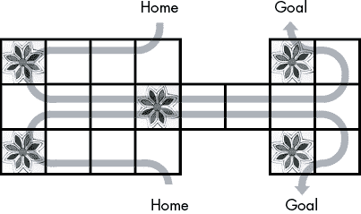

# #63 乌尔皇家游戏

> 原文：<http://inventwithpython.com/bigbookpython/project63.html>

乌尔的皇家游戏是一个来自美索不达米亚的有 5000 年历史的游戏。考古学家在 1922 年至 1934 年间的挖掘过程中，在现代伊拉克南部的乌尔皇家墓地重新发现了这款游戏。这些规则是根据游戏棋盘(如图 63-1 所示)和一块巴比伦泥板重建的，它们类似于 Parcheesi。你需要运气和技巧才能赢。


图 63-1 :在乌尔皇家墓地发现的五块游戏板之一

两名玩家每人从家中的七个代币开始，第一个将所有七个代币移动到目标位置的玩家获胜。玩家轮流掷出四个骰子。这些骰子是称为四面体的四角金字塔形状。每个骰子都有两个标记点，这使得骰子有标记或无标记的机会均等。我们的游戏用硬币代替骰子，硬币的头部作为标记点。玩家可以为出现的每一个标记点移动一格代币。这意味着他们可以在 0 到 4 个空格之间移动一个令牌，尽管他们最有可能掷出两个空格。

代币沿着图 63-2 中[所示的路径行进。一个空间上一次只能存在一个令牌。如果一个代币在共享中间路径上落在对手的代币上，对手的代币会被送回家。如果一个代币落在中间的花方格上，它就不会被落在上面。如果一个代币落在其他四个花牌中的任何一个上，玩家可以再掷一次。我们的游戏将用字母 *X* 和 *O* 来代表代币。](#calibre_link-350)



图 63-2 :每个玩家的令牌从他们的家到他们的目标的路径

在 https://www.youtube.com/watch?v=WZskjLq040I 可以找到优图伯·汤姆·斯科特和大英博物馆馆长欧文·芬克尔讨论乌尔王族游戏的视频。

## 行动中的计划

当您运行 *royalgameofur.py* 时，输出将如下所示:

```py
The Royal Game of Ur, by Al Sweigart
`--snip--`
                   XXXXXXX           .......
                   Home              Goal
                     v                 ^
+-----+-----+-----+--v--+           +--^--+-----+
|*****|     |     |     |           |*****|     |
|*   *<     <     <     |           |*   *<     |
|****h|    g|    f|    e|           |****t|    s|
+--v--+-----+-----+-----+-----+-----+-----+--^--+
|     |     |     |*****|     |     |     |     |
|     >     >     >*   *>     >     >     >     |
|    i|    j|    k|****l|    m|    n|    o|    p|
+--^--+-----+-----+-----+-----+-----+-----+--v--+
|*****|     |     |     |           |*****|     |
|*   *<     <     <     |           |*   *<     |
|****d|    c|    b|    a|           |****r|    q|
+-----+-----+-----+--^--+           +--v--+-----+
                     ^                 v
                   Home              Goal
                   OOOOOOO           .......

It is O's turn. Press Enter to flip...
Flips: H-H-H-H  Select token to move 4 spaces: home quit
> **home**
O landed on a flower space and gets to go again.
Press Enter to continue...
`--snip--`
```

## 它是如何工作的

就像项目 43“曼卡拉”一样，ASCII 艺术游戏棋盘上的空格用字母 *a* 到 *t* 标注。掷骰子后，玩家可以选择一个包含其代币的空间来移动代币，或者他们可以选择`home`开始将代币从家中移到棋盘上。该程序将棋盘表示为一个字典，其中键为`'a'`到`'t'`，值为`'X'`和`'O'`用于标记(或`' '`用于空格)。

此外，这个字典有关键字`'x_home'`、`'o_home'`、`'x_goal'`和`'o_goal'`，这些关键字的值是七个字符的字符串，表示家庭和目标有多满。这些字符串中的`'X'`或`'O'`字符代表主场或球门的代币，`'.'`代表空位置。`displayBoard()`函数在屏幕上显示这七个字符串。

```py
 1\. """The Royal Game of Ur, by Al Sweigart [[email protected]](/cdn-cgi/l/email-protection)
 2\. A 5,000 year old board game from Mesopotamia. Two players knock each
 3\. other back as they race for the goal.
 4\. More info https://en.wikipedia.org/wiki/Royal_Game_of_Ur
 5\. This code is available at https://nostarch.com/big-book-small-python-programming
 6\. Tags: large, board game, game, two-player
 7\. """
 8\. 
 9\. import random, sys
 10\. 
 11\. X_PLAYER = 'X'
 12\. O_PLAYER = 'O'
 13\. EMPTY = ' '
 14\. 
 15\. # Set up constants for the space labels:
 16\. X_HOME = 'x_home'
 17\. O_HOME = 'o_home'
 18\. X_GOAL = 'x_goal'
 19\. O_GOAL = 'o_goal'
 20\. 
 21\. # The spaces in left to right, top to bottom order:
 22\. ALL_SPACES = 'hgfetsijklmnopdcbarq'
 23\. X_TRACK = 'HefghijklmnopstG'  # (H stands for Home, G stands for Goal.)
 24\. O_TRACK = 'HabcdijklmnopqrG'
 25\. 
 26\. FLOWER_SPACES = ('h', 't', 'l', 'd', 'r')
 27\. 
 28\. BOARD_TEMPLATE = """
 29\. {}  {} 30\.                   Home              Goal
 31\.                     v                 ^
 32\. +-----+-----+-----+--v--+           +--^--+-----+
 33\. |*****|     |     |     |           |*****|     |
 34\. |* {} *< {} < {} < {} |           |* {} *< {} |
 35\. |****h|    g|    f|    e|           |****t|    s|
 36\. +--v--+-----+-----+-----+-----+-----+-----+--^--+
 37\. |     |     |     |*****|     |     |     |     |
 38\. | {} > {} > {} >* {} *> {} > {} > {} > {} |
 39\. |    i|    j|    k|****l|    m|    n|    o|    p|
 40\. +--^--+-----+-----+-----+-----+-----+-----+--v--+
 41\. |*****|     |     |     |           |*****|     |
 42\. |* {} *< {} < {} < {} |           |* {} *< {} |
 43\. |****d|    c|    b|    a|           |****r|    q|
 44\. +-----+-----+-----+--^--+           +--v--+-----+
 45\.                     ^                 v
 46\.                   Home              Goal
 47\. {}  {} 48\. """
 49\. 
 50\. 
 51\. def main():
 52\.    print('''The Royal Game of Ur, by Al Sweigart
 53\. 
 54\. This is a 5,000 year old game. Two players must move their tokens
 55\. from their home to their goal. On your turn you flip four coins and can
 56\. move one token a number of spaces equal to the heads you got.
 57\. 
 58\. Ur is a racing game; the first player to move all seven of their tokens
 59\. to their goal wins. To do this, tokens must travel from their home to
 60\. their goal:
 61\. 
 62\.            X Home      X Goal
 63\.              v           ^
 64\. +---+---+---+-v-+       +-^-+---+
 65\. |v<<<<<<<<<<<<< |       | ^<|<< |
 66\. |v  |   |   |   |       |   | ^ |
 67\. +v--+---+---+---+---+---+---+-^-+
 68\. |>>>>>>>>>>>>>>>>>>>>>>>>>>>>>^ |
 69\. |>>>>>>>>>>>>>>>>>>>>>>>>>>>>>v |
 70\. +^--+---+---+---+---+---+---+-v-+
 71\. |^  |   |   |   |       |   | v |
 72\. |^<<<<<<<<<<<<< |       | v<<<< |
 73\. +---+---+---+-^-+       +-v-+---+
 74\.              ^           v
 75\.            O Home      O Goal
 76\. 
 77\. If you land on an opponent's token in the middle track, it gets sent
 78\. back home. The **flower** spaces let you take another turn. Tokens in
 79\. the middle flower space are safe and cannot be landed on.''')
 80\.    input('Press Enter to begin...')
 81\. 
 82\.    gameBoard = getNewBoard()
 83\.    turn = O_PLAYER
 84\.    while True:  # Main game loop.
 85\.        # Set up some variables for this turn:
 86\.        if turn == X_PLAYER:
 87\.            opponent = O_PLAYER
 88\.            home = X_HOME
 89\.            track = X_TRACK
 90\.            goal = X_GOAL
 91\.            opponentHome = O_HOME
 92\.        elif turn == O_PLAYER:
 93\.            opponent = X_PLAYER
 94\.            home = O_HOME
 95\.            track = O_TRACK
 96\.            goal = O_GOAL
 97\.            opponentHome = X_HOME
 98\. 
 99\.        displayBoard(gameBoard)
100\. 
101\.         input('It is ' + turn + '\'s turn. Press Enter to flip...')
102\. 
103\.         flipTally = 0
104\.         print('Flips: ', end='')
105\.         for i in range(4):  # Flip 4 coins.
106\.             result = random.randint(0, 1)
107\.             if result == 0:
108\.                 print('T', end='')  # Tails.
109\.             else:
110\.                 print('H', end='')  # Heads.
111\.             if i != 3:
112\.                 print('-', end='')  # Print separator.
113\.             flipTally += result
114\.         print('  ', end='')
115\. 
116\.         if flipTally == 0:
117\.             input('You lose a turn. Press Enter to continue...')
118\.             turn = opponent  # Swap turns to the other player.
119\.             continue
120\. 
121\.         # Ask the player for their move:
122\.         validMoves = getValidMoves(gameBoard, turn, flipTally)
123\. 
124\.         if validMoves == []:
125\.             print('There are no possible moves, so you lose a turn.')
126\.             input('Press Enter to continue...')
127\.             turn = opponent  # Swap turns to the other player.
128\.             continue
129\. 
130\.         while True:
131\.             print('Select move', flipTally, 'spaces: ', end='')
132\.             print(' '.join(validMoves) + ' quit')
133\.             move = input('> ').lower()
134\. 
135\.             if move == 'quit':
136\.                 print('Thanks for playing!')
137\.                 sys.exit()
138\.             if move in validMoves:
139\.                 break  # Exit the loop when a valid move is selected.
140\. 
141\.             print('That is not a valid move.')
142\. 
143\.         # Perform the selected move on the board:
144\.         if move == 'home':
145\.             # Subtract tokens at home if moving from home:
146\.             gameBoard[home] -= 1
147\.             nextTrackSpaceIndex = flipTally
148\.         else:
149\.             gameBoard[move] = EMPTY  # Set the "from" space to empty.
150\.             nextTrackSpaceIndex = track.index(move) + flipTally
151\. 
152\.         movingOntoGoal = nextTrackSpaceIndex == len(track) - 1
153\.         if movingOntoGoal:
154\.             gameBoard[goal] += 1
155\.             # Check if the player has won:
156\.             if gameBoard[goal] == 7:
157\.                 displayBoard(gameBoard)
158\.                 print(turn, 'has won the game!')
159\.                 print('Thanks for playing!')
160\.                 sys.exit()
161\.         else:
162\.             nextBoardSpace = track[nextTrackSpaceIndex]
163\.             # Check if the opponent has a tile there:
164\.             if gameBoard[nextBoardSpace] == opponent:
165\.                 gameBoard[opponentHome] += 1
166\. 
167\.             # Set the "to" space to the player's token:
168\.             gameBoard[nextBoardSpace] = turn
169\. 
170\.         # Check if the player landed on a flower space and can go again:
171\.         if nextBoardSpace in FLOWER_SPACES:
172\.             print(turn, 'landed on a flower space and goes again.')
173\.             input('Press Enter to continue...')
174\.         else:
175\.             turn = opponent  # Swap turns to the other player.
176\. 
177\. def getNewBoard():
178\.     """
179\.     Returns a dictionary that represents the state of the board. The
180\.     keys are strings of the space labels, the values are X_PLAYER,
181\.     O_PLAYER, or EMPTY. There are also counters for how many tokens are
182\.     at the home and goal of both players.
183\.     """
184\.     board = {X_HOME: 7, X_GOAL: 0, O_HOME: 7, O_GOAL: 0}
185\.     # Set each space as empty to start:
186\.     for spaceLabel in ALL_SPACES:
187\.         board[spaceLabel] = EMPTY
188\.     return board
189\. 
190\. 
191\. def displayBoard(board):
192\.     """Display the board on the screen."""
193\.     # "Clear" the screen by printing many newlines, so the old
194\.     # board isn't visible anymore.
195\.     print('\n' * 60)
196\. 
197\.     xHomeTokens = ('X' * board[X_HOME]).ljust(7, '.')
198\.     xGoalTokens = ('X' * board[X_GOAL]).ljust(7, '.')
199\.     oHomeTokens = ('O' * board[O_HOME]).ljust(7, '.')
200\.     oGoalTokens = ('O' * board[O_GOAL]).ljust(7, '.')
201\. 
202\.     # Add the strings that should populate BOARD_TEMPLATE in order,
203\.     # going from left to right, top to bottom.
204\.     spaces = []
205\.     spaces.append(xHomeTokens)
206\.     spaces.append(xGoalTokens)
207\.     for spaceLabel in ALL_SPACES:
208\.         spaces.append(board[spaceLabel])
209\.     spaces.append(oHomeTokens)
210\.     spaces.append(oGoalTokens)
211\. 
212\.     print(BOARD_TEMPLATE.format(*spaces))
213\. 
214\. 
215\. def getValidMoves(board, player, flipTally):
216\.     validMoves = []  # Contains the spaces with tokens that can move.
217\.     if player == X_PLAYER:
218\.         opponent = O_PLAYER
219\.         track = X_TRACK
220\.         home = X_HOME
221\.     elif player == O_PLAYER:
222\.         opponent = X_PLAYER
223\.         track = O_TRACK
224\.         home = O_HOME
225\. 
226\.     # Check if the player can move a token from home:
227\.     if board[home] > 0 and board[track[flipTally]] == EMPTY:
228\.         validMoves.append('home')
229\. 
230\.     # Check which spaces have a token the player can move:
231\.     for trackSpaceIndex, space in enumerate(track):
232\.         if space == 'H' or space == 'G' or board[space] != player:
233\.             continue
234\.         nextTrackSpaceIndex = trackSpaceIndex + flipTally
235\.         if nextTrackSpaceIndex >= len(track):
236\.             # You must flip an exact number of moves onto the goal,
237\.             # otherwise you can't move on the goal.
238\.             continue
239\.         else:
240\.             nextBoardSpaceKey = track[nextTrackSpaceIndex]
241\.             if nextBoardSpaceKey == 'G':
242\.                 # This token can move off the board:
243\.                 validMoves.append(space)
244\.                 continue
245\.         if board[nextBoardSpaceKey] in (EMPTY, opponent):
246\.             # If the next space is the protected middle space, you
247\.             # can only move there if it is empty:
248\.             if nextBoardSpaceKey == 'l' and board['l'] == opponent:
249\.                 continue  # Skip this move, the space is protected.
250\.             validMoves.append(space)
251\. 
252\.     return validMoves
253\. 
254\. 
255\. if __name__ == '__main__':
256\.     main() 
```

## 探索计划

试着找出下列问题的答案。尝试对代码进行一些修改，然后重新运行程序，看看这些修改有什么影响。

1.  如果把 152 行的`nextTrackSpaceIndex == len(track) - 1`改成`nextTrackSpaceIndex == 1`会怎么样？
2.  如果把 106 行的`result = random.randint(0, 1)`改成`result = 1`会怎么样？
3.  如果把 184 行的`board = {X_HOME: 7, X_GOAL: 0, O_HOME: 7, O_GOAL: 0}`改成`board = {}`会导致什么错误？