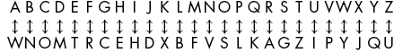

# 六十六、简单替换密码

> 原文：<http://inventwithpython.com/bigbookpython/project66.html>


简单替换密码用一个字母代替另一个字母。由于字母`A`有 26 种可能的替换，`B`有 25 种可能的替换，`C`有 24 种可能的替换，等等，所以可能的键的总数是`26 × 25 × 24 × 23 × ... × 1`，即 403291461126605635584000000 个密钥！对于一台超级计算机来说，这对于暴力破解来说太多了，所以项目 7“凯撒破解”中使用的密码破解方法不能用于对抗简单的密码。不幸的是，狡猾的攻击者可以利用已知的弱点来破解代码。如果你想了解更多关于密码和密码破解的知识，你可以阅读我的书[《Python 密码破解指南》](https://nostarch.com/crackingcodes/)（NoStarch出版社，2018）。

## 运行示例

当您运行`simplesubcipher.py`时，输出将如下所示：

```py
Simple Substitution Cipher, by Al Sweigart
A simple substitution cipher has a one-to-one translation for each
symbol in the plaintext and each symbol in the ciphertext.
Do you want to (e)ncrypt or (d)ecrypt?
> e
Please specify the key to use.
Or enter RANDOM to have one generated for you.
> random
The key is WNOMTRCEHDXBFVSLKAGZIPYJQU. KEEP THIS SECRET!
Enter the message to encrypt.
> Meet me by the rose bushes tonight.
The encrypted message is:
Fttz ft nq zet asgt nigetg zsvhcez.
Full encrypted text copied to clipboard.

Simple Substitution Cipher, by Al Sweigart
A simple substitution cipher has a one-to-one translation for each
symbol in the plaintext and each symbol in the ciphertext.
Do you want to (e)ncrypt or (d)ecrypt?
> d
Please specify the key to use.
> WNOMTRCEHDXBFVSLKAGZIPYJQU
Enter the message to decrypt.
> Fttz ft nq zet asgt nigetg zsvhcez.
The decrypted message is:
Meet me by the rose bushes tonight.
Full decrypted text copied to clipboard.
```

## 工作原理

密钥的 26 个字母中的每一个的位置对应于字母表中相同位置的字母：



:字母表中的字母如何用一个以`WNOM`开头的密钥加密。若要解密，请将底部的字母替换为上面相应的字母。

用这个密钥，字母`A`加密到`W` （而`W`解密到`A`，字母`B`加密到`N`，以此类推。`LETTERS`和`key`变量被分配给`charsA`和`charsB`（或者在解密时反过来）。用`charsB`中的相应字符替换`charsA`中的任何消息字符，以产生最终翻译的消息。

```py
"""Simple Substitution Cipher, by Al Sweigart email@protected
A simple substitution cipher has a one-to-one translation for each
symbol in the plaintext and each symbol in the ciphertext.
More info at: https://en.wikipedia.org/wiki/Substitution_cipher
This code is available at https://nostarch.com/big-book-small-python-programming
Tags: short, cryptography, math"""

import random

try:
   import pyperclip  # pyperclip copies text to the clipboard.
except ImportError:
   pass  # If pyperclip is not installed, do nothing. It's no big deal.

# Every possible symbol that can be encrypted/decrypted:
LETTERS = 'ABCDEFGHIJKLMNOPQRSTUVWXYZ'

def main():
   print('''Simple Substitution Cipher, by Al Sweigart
A simple substitution cipher has a one-to-one translation for each
symbol in the plaintext and each symbol in the ciphertext.''')

   # Let the user specify if they are encrypting or decrypting:
   while True:  # Keep asking until the user enters e or d.
       print('Do you want to (e)ncrypt or (d)ecrypt?')
       response = input('> ').lower()
       if response.startswith('e'):
           myMode = 'encrypt'
           break
       elif response.startswith('d'):
           myMode = 'decrypt'
           break
       print('Please enter the letter e or d.')

   # Let the user specify the key to use:
   while True:  # Keep asking until the user enters a valid key.
       print('Please specify the key to use.')
       if myMode == 'encrypt':
           print('Or enter RANDOM to have one generated for you.')
       response = input('> ').upper()
       if response == 'RANDOM':
           myKey = generateRandomKey()
           print('The key is {}. KEEP THIS SECRET!'.format(myKey))
           break
       else:
           if checkKey(response):
               myKey = response
               break

   # Let the user specify the message to encrypt/decrypt:
   print('Enter the message to {}.'.format(myMode))
   myMessage = input('> ')

   # Perform the encryption/decryption:
   if myMode == 'encrypt':
       translated = encryptMessage(myMessage, myKey)
   elif myMode == 'decrypt':
       translated = decryptMessage(myMessage, myKey)

   # Display the results:
   print('The %sed message is:' % (myMode))
   print(translated)

   try:
       pyperclip.copy(translated)
       print('Full %sed text copied to clipboard.' % (myMode))
   except:
       pass  # Do nothing if pyperclip wasn't installed.


def checkKey(key):
   """Return True if key is valid. Otherwise return False."""
   keyList = list(key)
   lettersList = list(LETTERS)
   keyList.sort()
   lettersList.sort()
   if keyList != lettersList:
       print('There is an error in the key or symbol set.')
       return False
   return True


def encryptMessage(message, key):
   """Encrypt the message using the key."""
   return translateMessage(message, key, 'encrypt')


def decryptMessage(message, key):
   """Decrypt the message using the key."""
   return translateMessage(message, key, 'decrypt')


def translateMessage(message, key, mode):
   """Encrypt or decrypt the message using the key."""
   translated = ''
   charsA = LETTERS
   charsB = key
   if mode == 'decrypt':
       # For decrypting, we can use the same code as encrypting. We
        # just need to swap where the key and LETTERS strings are used.
        charsA, charsB = charsB, charsA

    # Loop through each symbol in the message:
    for symbol in message:
        if symbol.upper() in charsA:
            # Encrypt/decrypt the symbol:
            symIndex = charsA.find(symbol.upper())
            if symbol.isupper():
                translated += charsB[symIndex].upper()
            else:
                translated += charsB[symIndex].lower()
        else:
            # The symbol is not in LETTERS, just add it unchanged.
            translated += symbol

    return translated


def generateRandomKey():
    """Generate and return a random encryption key."""
    key = list(LETTERS)  # Get a list from the LETTERS string.
    random.shuffle(key)  # Randomly shuffle the list.
    return ''.join(key)  # Get a string from the list.


# If this program was run (instead of imported), run the program:
if __name__ == '__main__':
    main() 
```

## 探索程序

试着找出下列问题的答案。尝试对代码进行一些修改，然后重新运行程序，看看这些修改有什么影响。

1.  如果删除或注释掉第 122 行的`random.shuffle(key)`并输入密钥`RANDOM`会发生什么？
2.  如果将第 16 行的`LETTERS`字符串扩展成`'ABCDEFGHIJKLMNOPQRSTUVWXYZ1234567890'`会发生什么？