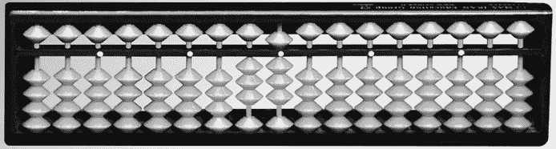

# #70 Soroban 日本算盘

> 原文：<http://inventwithpython.com/bigbookpython/project70.html>


算盘，也称为计数框，是一种计算工具，早在电子计算器发明之前就在许多文化中使用。图 70-1 显示了日本的算盘，叫做 soroban。每根线代表一个位置数字系统中的一个位置，线上的珠子代表该位置的数字。例如，一个索洛班在最右边的线上移动了两个珠子，在第二个最右边的线上移动了三个珠子，这将表示数字 32。这个程序模拟了一个索洛班。(讽刺的是，用一台计算机来模拟一个计算机前的计算工具对我来说并非没有意义。)



:索罗班

soroban 中的每一列代表一个不同的数字。最右边的列是个位，左边的列是个位，左边的列是个位，以此类推。键盘顶部的 Q、W、E、R、T、Y、U、I、O 和 P 键可以增加它们各自位置的数字，而 A、S、D、F、G、H、J、K、L 和；按键会减少它们。虚拟 soroban 上的珠子会滑动以反映当前的数字。也可以直接输入数字。

水平分隔线下面的四个珠子是“地球”珠子，将它们举到分隔线上，该数字计为 1。水平分隔线上方的珠子是一个“天堂”珠子，对着分隔线向下拉动它会对该数字计数为 5，因此在十位栏中向下拉动一个天堂珠子并向上拉动三个地球珠子代表数字 80。更多关于算盘以及如何使用它们的信息可以在`/en.wikipedia.org/wiki/Abacus`找到。

## 行动中的计划

当您运行 `soroban.py` 时，输出将如下所示:

```py
Soroban - The Japanese Abacus
By Al Sweigart email@protected

+================================+
I  O  O  O  O  O  O  O  O  O  O  I
I  |  |  |  |  |  |  |  |  |  |  I
I  |  |  |  |  |  |  |  |  |  |  I
+================================+
I  |  |  |  |  |  |  |  |  |  |  I
I  |  |  |  |  |  |  |  |  |  |  I
I  O  O  O  O  O  O  O  O  O  O  I
I  O  O  O  O  O  O  O  O  O  O  I
I  O  O  O  O  O  O  O  O  O  O  I
I  O  O  O  O  O  O  O  O  O  O  I
+==0==0==0==0==0==0==0==0==0==0==+
  +q  w  e  r  t  y  u  i  o  p
  -a  s  d  f  g  h  j  k  l  ;
(Enter a number, "quit", or a stream of up/down letters.)
> pppiiiii

+================================+
I  O  O  O  O  O  O  O  |  O  O  I
I  |  |  |  |  |  |  |  |  |  |  I
I  |  |  |  |  |  |  |  O  |  |  I
+================================+
I  |  |  |  |  |  |  |  |  |  O  I
I  |  |  |  |  |  |  |  |  |  O  I
I  O  O  O  O  O  O  O  O  O  O  I
I  O  O  O  O  O  O  O  O  O  |  I
I  O  O  O  O  O  O  O  O  O  |  I
I  O  O  O  O  O  O  O  O  O  O  I
+==0==0==0==0==0==0==0==5==0==3==+
  +q  w  e  r  t  y  u  i  o  p
  -a  s  d  f  g  h  j  k  l  ;
(Enter a number, "quit", or a stream of up/down letters.)
`--snip--`
```

## 它是如何工作的

`displayAbacus()`函数接受一个`number`参数，该参数用于计算应该在算盘上的什么位置呈现珠子。索罗班总是正好有 80 个可能的位置来放置`'O'` 珠子或`'|'`杆段，如第 127 到 139 行多行字符串中的花括号(`{}`)所示。另外 10 个花括号代表`number`参数的数字。

我们需要创建一个字符串列表来填充这些花括号，从左到右，从上到下。`displayAbacus()`中的代码将用一个`True`值填充一个`hasBead`列表以显示一个`'O'`珠子，用一个`False`值显示一个`'|'`。该列表中的前 10 个值是针对顶部“天堂”行的。如果列的数字是 0、1、2、3 或 4，我们将在该行中放置一个珠子，因为除非该列的数字是 0 到 4，否则天堂珠子不会在该行中。对于剩余的行，我们将布尔值添加到`hasBead`。

第 118 到 123 行使用`hasBead`创建一个包含实际的`'O'`和`'|'`字符串的`abacusChar`列表。当与第 126 行的`numberList`结合时，程序形成一个`chars`列表，填充 soroban 的多行字符串 ASCII 艺术的花括号(`{}`)。

```py
"""Soroban Japanese Abacus, by Al Sweigart email@protected
A simulation of a Japanese abacus calculator tool.
More info at: https://en.wikipedia.org/wiki/Soroban
This code is available at https://nostarch.com/big-book-small-python-programming
Tags: large, artistic, math, simulation"""

NUMBER_OF_DIGITS = 10


def main():
   print('Soroban - The Japanese Abacus')
   print('By Al Sweigart email@protected')
   print()

   abacusNumber = 0  # This is the number represented on the abacus.

   while True:  # Main program loop.
       displayAbacus(abacusNumber)
       displayControls()

       commands = input('> ')
       if commands == 'quit':
           # Quit the program:
           break
       elif commands.isdecimal():
           # Set the abacus number:
           abacusNumber = int(commands)
       else:
           # Handle increment/decrement commands:
           for letter in commands:
               if letter == 'q':
                   abacusNumber += 1000000000
               elif letter == 'a':
                   abacusNumber -= 1000000000
               elif letter == 'w':
                   abacusNumber += 100000000
               elif letter == 's':
                   abacusNumber -= 100000000
               elif letter == 'e':
                   abacusNumber += 10000000
               elif letter == 'd':
                   abacusNumber -= 10000000
               elif letter == 'r':
                   abacusNumber += 1000000
               elif letter == 'f':
                   abacusNumber -= 1000000
               elif letter == 't':
                   abacusNumber += 100000
               elif letter == 'g':
                   abacusNumber -= 100000
               elif letter == 'y':
                   abacusNumber += 10000
               elif letter == 'h':
                   abacusNumber -= 10000
               elif letter == 'u':
                   abacusNumber += 1000
               elif letter == 'j':
                   abacusNumber -= 1000
               elif letter == 'i':
                   abacusNumber += 100
               elif letter == 'k':
                   abacusNumber -= 100
               elif letter == 'o':
                   abacusNumber += 10
               elif letter == 'l':
                   abacusNumber -= 10
               elif letter == 'p':
                   abacusNumber += 1
               elif letter == ';':
                   abacusNumber -= 1

       # The abacus can't show negative numbers:
       if abacusNumber < 0:
           abacusNumber = 0  # Change any negative numbers to 0.
       # The abacus can't show numbers larger than 9999999999:
       if abacusNumber > 9999999999:
           abacusNumber = 9999999999


def displayAbacus(number):
   numberList = list(str(number).zfill(NUMBER_OF_DIGITS))

   hasBead = []  # Contains a True or False for each bead position.

   # Top heaven row has a bead for digits 0, 1, 2, 3, and 4.
   for i in range(NUMBER_OF_DIGITS):
       hasBead.append(numberList[i] in '01234')

   # Bottom heaven row has a bead for digits 5, 6, 7, 8, and 9.
   for i in range(NUMBER_OF_DIGITS):
       hasBead.append(numberList[i] in '56789')

   # 1st (topmost) earth row has a bead for all digits except 0.
   for i in range(NUMBER_OF_DIGITS):
       hasBead.append(numberList[i] in '12346789')

   # 2nd earth row has a bead for digits 2, 3, 4, 7, 8, and 9.
   for i in range(NUMBER_OF_DIGITS):
       hasBead.append(numberList[i] in '234789')

    # 3rd earth row has a bead for digits 0, 3, 4, 5, 8, and 9.
    for i in range(NUMBER_OF_DIGITS):
        hasBead.append(numberList[i] in '034589')

    # 4th earth row has a bead for digits 0, 1, 2, 4, 5, 6, and 9.
    for i in range(NUMBER_OF_DIGITS):
        hasBead.append(numberList[i] in '014569')

    # 5th earth row has a bead for digits 0, 1, 2, 5, 6, and 7.
    for i in range(NUMBER_OF_DIGITS):
        hasBead.append(numberList[i] in '012567')

    # 6th earth row has a bead for digits 0, 1, 2, 3, 5, 6, 7, and 8.
    for i in range(NUMBER_OF_DIGITS):
        hasBead.append(numberList[i] in '01235678')

    # Convert these True or False values into O or | characters.
    abacusChar = []
    for i, beadPresent in enumerate(hasBead):
        if beadPresent:
            abacusChar.append('O')
        else:
            abacusChar.append('|')

    # Draw the abacus with the O/| characters.
    chars = abacusChar + numberList
    print("""
+================================+
I {}  {}  {}  {}  {}  {}  {}  {}  {}  {} I
I  |  |  |  |  |  |  |  |  |  |  I
I {}  {}  {}  {}  {}  {}  {}  {}  {}  {} I
+================================+
I {}  {}  {}  {}  {}  {}  {}  {}  {}  {} I
I {}  {}  {}  {}  {}  {}  {}  {}  {}  {} I
I {}  {}  {}  {}  {}  {}  {}  {}  {}  {} I
I {}  {}  {}  {}  {}  {}  {}  {}  {}  {} I
I {}  {}  {}  {}  {}  {}  {}  {}  {}  {} I
I {}  {}  {}  {}  {}  {}  {}  {}  {}  {} I
+=={}=={}=={}=={}=={}=={}=={}=={}=={}=={}==+""".format(*chars))


def displayControls():
    print('  +q  w  e  r  t  y  u  i  o  p')
    print('  -a  s  d  f  g  h  j  k  l  ;')
    print('(Enter a number, "quit", or a stream of up/down letters.)')


if __name__ == '__main__':
    main() 
```

## 探索计划

试着找出下列问题的答案。尝试对代码进行一些修改，然后重新运行程序，看看这些修改有什么影响。

1.  如果把第 15 行的`abacusNumber = 0`改成`abacusNumber = 9999`会怎么样？
2.  如果把 121 行的`abacusChar.append('O')`改成`abacusChar.append('@')`会怎么样？